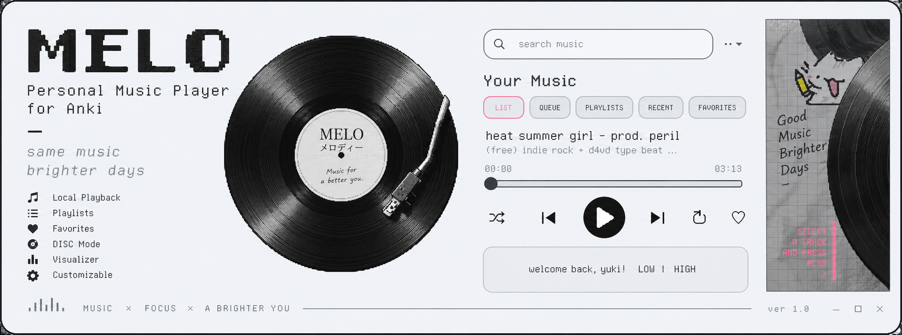
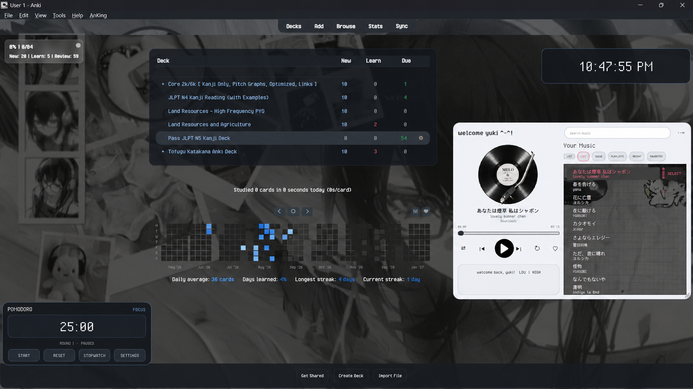

<p align="center">
  
</p>

<p align="center">
  <strong>Personal Music Player for Anki</strong><br>
  Retro-inspired local music player with playlists, Favorites, DISC mode, visualizer and customizable ambience.
</p>

<h1 align="center">MELO</h1>

<p align="center">
  <strong>Version 1.0.2</strong><br>
  Copyright © 2026 Yuki
</p>

MELO is a personal music player built for the Anki desktop environment. It combines local music playback with a compact retro-inspired interface, a vinyl-style visual display, playlists, favorites, visualizations, and customizable ambience.

---

## What's New in v1.0.2

MELO v1.0.2 adds improved library management, persistent player positioning, and high-resolution vinyl assets.

### Library management

- Added **REMOVE FOLDER FROM LIBRARY** to the `•••` menu.
- Select a previously imported folder and remove its tracks from MELO's library in one action.
- Matching tracks are removed from the library, Favorites, Recent, and Playlists.
- The actual music files on your computer are **never deleted**.

### Visual update

- Added high-resolution vinyl artwork.
- Added a high-resolution tonearm layer.
- The record rotates independently while the tonearm remains fixed.

### Persistent player position

- MELO remembers where the player was last placed.
- The saved position is restored after restarting Anki.
- Resizing the player does not reset its saved position.

---

# Preview

### MELO in LIST Mode

<p align="center">
  
</p>

### MELO in DISC Mode

<p align="center">
  
</p>

### MELO inside Anki

<p align="center">
  
</p>

---

## Features

- Local music playback
- Import individual audio files or entire folders
- Persistent music library
- LIST and DISC browsing modes
- Search
- Queue
- Custom playlists
- Recently played tracks
- Favorites
- Shuffle and repeat
- Clickable and draggable seek bar
- Audio-reactive LOW / HIGH visualizer
- Independent spinning vinyl display
- High-resolution vinyl and tonearm artwork
- Custom selector background
- Personalized first-launch name
- Resizable and draggable player window
- Persistent player position
- Folder-based library removal
- Keyboard controls
- Persistent settings

---

## Installation

1. Download the latest `.ankiaddon` file from the [Releases](../../releases) page.
2. Open **Anki**.
3. Go to **Tools → Add-ons → Install from file**.
4. Select the MELO `.ankiaddon` file.
5. Restart Anki.
6. On first launch, MELO asks:

   > **What should I call you?**

7. Enter the name you want MELO to use.

The name is stored locally in Anki's addon configuration.

---

## First Launch

MELO does not ship with the author's name as a user default.

On first launch, the addon asks:

> **What should I call you?**

The name you enter is saved locally and used for:

```text
welcome back, [name]!
```

This allows the same release to be shared without exposing the author's name as another user's default.

---

# Interface

## Search

The search field filters the current library section.

Search can be used to quickly find tracks in the current view.

## `•••` Menu

The `•••` menu provides library and customization actions.

| Menu item | Function |
|---|---|
| `+ MUSIC` | Import individual audio files |
| `+ FOLDER` | Recursively import supported audio files from a folder |
| `+ PLAYLIST` | Create a new playlist |
| `ADD CURRENT TO PLAYLIST` | Add the current track to a playlist |
| Favorite action | Add or remove the current track from Favorites |
| `REMOVE FOLDER FROM LIBRARY` | Remove all MELO library entries originating from a selected folder |
| `CHANGE BACKGROUND...` | Choose a custom selector background |
| `RESET BACKGROUND` | Restore the default selector background |

### Remove a previously imported folder

Use:

```text
••• → REMOVE FOLDER FROM LIBRARY
```

Then select the folder.

MELO removes matching entries from its own library and associated collections. It does **not** delete the audio files or the folder from Windows.

This also works for folders imported before v1.0.2 because MELO checks the stored file paths.

---

# Playback Controls

The playback area contains the current track, progress, and playback controls.

| Control | Function |
|---|---|
| `⇄` | Toggle Shuffle |
| `|◀` | Previous track |
| `▶ / ⏸` | Play / Pause |
| `▶|` | Next track |
| `↻` | Toggle Repeat |
| `♡ / ♥` | Add or remove the current track from Favorites |
| Progress bar | Click anywhere or drag to seek |

### Previous Track

Pressing Previous normally moves to the previous track.

If the current song has already been playing for a while, pressing Previous can first return the current song to the beginning.

---

# Library

MELO has five main library sections:

## LIST

Your complete music library in a normal scrollable list.

- Click a track to select it.
- Use the list to browse your library.
- Use Search to filter visible tracks.

## QUEUE

Shows tracks currently waiting to play.

## PLAYLISTS

Shows your saved playlists.

To create a playlist:

1. Open `•••`.
2. Select **+ PLAYLIST**.
3. Enter a playlist name.

To add the current track:

1. Open `•••`.
2. Select **ADD CURRENT TO PLAYLIST**.
3. Choose a playlist.

Click a playlist to view its tracks.

## RECENT

Shows tracks that were played recently.

## FAVORITES

Shows tracks that you have marked as favorites.

A track can be favorited with either:

- the `♡ / ♥` playback button, or
- the Favorites option in the `•••` menu.

---

# LIST Mode

LIST mode is the standard music-library view.

It is best for browsing a large library, searching, and selecting a particular track directly.

The library is vertically scrollable.

---

# DISC Mode

DISC mode is MELO's vinyl-style track selector.

Several track titles are displayed around the currently selected track, creating a wheel-like browsing interface.

### DISC keyboard controls

| Key | Function |
|---|---|
| `←` | Rotate the DISC selector one step left |
| `→` | Rotate the DISC selector one step right |
| `Enter` | **Select/play the currently highlighted DISC track** |
| `Space` | Play / Pause |

The arrow keys control the **DISC selector itself**. They are not merely previous/next playback commands while browsing the wheel.

The selected track is the highlighted center item. Pressing **Enter** plays that selected track.

The selector animates between selections, and the vinyl display spins independently while music is playing.

The vinyl texture is supplied by MELO and is not taken from MP3 embedded cover artwork.

---

# Visualizer

The personal panel contains an audio-reactive visualizer divided into two sections:

```text
LOW | HIGH
```

- **LOW** frequency bars appear on the left.
- **HIGH** frequency bars appear on the right.
- All visualizer bars use the MELO pink accent.
- A central divider separates LOW and HIGH.
- The visualizer clears when playback stops.

---

# Vinyl Display

MELO uses a high-resolution vinyl design for the record display.

The record:

- spins while music is playing
- stops when playback stops
- rotates independently from the tonearm
- uses a separate high-resolution tonearm layer
- does not use MP3 embedded cover artwork as its texture

The tonearm remains visually fixed while the record rotates.

---

# Custom Background

MELO supports a custom image inside the music-selector area.

The outer player remains its normal light/off-white interface while the custom image appears inside the selector area behind LIST / DISC content.

### Change from the menu

Use:

```text
••• → CHANGE BACKGROUND...
```

To restore the default:

```text
••• → RESET BACKGROUND
```

### Configuration

The path is stored in:

```json
"background_path": ""
```

A Windows path in JSON must escape backslashes:

```json
"background_path": "C:\\Music\\background.jpg"
```

The configured image is used for the selector area in both LIST and DISC modes.

---

# Keyboard Shortcuts

| Key | Function |
|---|---|
| `Space` | Play / Pause |
| `←` | Move DISC selector left |
| `→` | Move DISC selector right |
| `Enter` | Play the selected DISC track |

---

# Window Controls

MELO is designed as a compact desktop-style music player inside Anki.

### Dragging

Drag the player from a non-interactive area to move it.

### Resizing

Use the resize area to resize the player.

### Persistent Position

MELO remembers the position where you last placed the player.

- Move the player to the desired location.
- MELO saves the position automatically.
- Restarting Anki restores the saved position.
- Resizing the player does not reset the saved position.

---

# Persistent Data

MELO stores its settings in Anki's addon configuration.

Stored information includes:

```text
tracks
volume
shuffle
repeat
mode
welcome_name
recent
favorites
playlists
background_path
player_x
player_y
```

This allows preferences, library data, playlists, Favorites, browsing mode, and player position to persist between restarts.

---

# Supported Audio

MELO supports common local audio formats including:

```text
MP3
WAV
OGG
OGA
FLAC
M4A
AAC
OPUS
WMA
```

Folder importing searches recursively for supported formats.

---

# Source Code

The repository contains the source used to build MELO, its configuration files, and bundled assets.

Main source entry point:

```text
__init__.py
```

Manifest:

```text
manifest.json
```

Configuration template:

```text
config.json
```

---

# Project Structure

```text
melo-anki-music-player/
├── __init__.py
├── manifest.json
├── config.json
├── README.md
├── LICENSE.txt
├── NOTICE.txt
├── .gitignore
└── assets/
    ├── melo-banner.png
    ├── play_icon.png
    ├── pause_icon.png
    ├── disc_texture_centered.png
    ├── arm_overlay_centered.png
    ├── melo_disc_texture_hr.png
    ├── melo_tonearm_hr.png
    └── screenshots/
        ├── melo-list-mode.png
        ├── melo-disc-mode.png
        └── melo-in-anki.png
```

The installable `.ankiaddon` package is distributed through the GitHub Releases page.

---

# Credits & Third-Party Materials

MELO is a custom project by **Yuki**.

**Copyright © 2026 Yuki**

Third-party software, fonts, libraries, artwork, audio, and other materials remain the property of their respective owners and are subject to their respective licenses or permissions.

MELO does not claim ownership of user-provided music or other user-provided media.

---

# License

Copyright © 2026 Yuki.

See [`LICENSE.txt`](LICENSE.txt) for the applicable terms.

Unless explicitly permitted by the license or by the copyright holder, do not redistribute or repackage original MELO project material as your own.

---

# Release

## MELO v1.0.2

The latest MELO release, adding folder-based library removal, persistent player positioning, and the high-resolution vinyl/tonearm update while retaining the original v1.0 and v1.0.1 feature set.

Download the installable `.ankiaddon` package from the [MELO v1.0.2 release](../../releases/tag/v1.0.2).

---

# Previous Releases

### MELO v1.0.1

Added persistent music-player positioning between Anki restarts.

See the [MELO v1.0.1 release](../../releases/tag/v1.0.1).

### MELO v1.0

The first official MELO release.

See the [MELO v1.0 release](../../releases/tag/v1.0).

---

## Author

**Yuki**

Project: [MELO — Personal Music Player for Anki](https://github.com/Yukidev-404/melo-anki-music-player)
